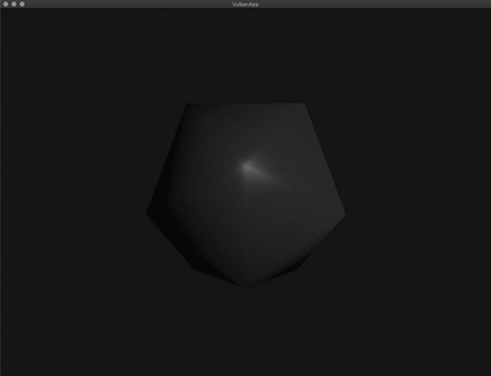
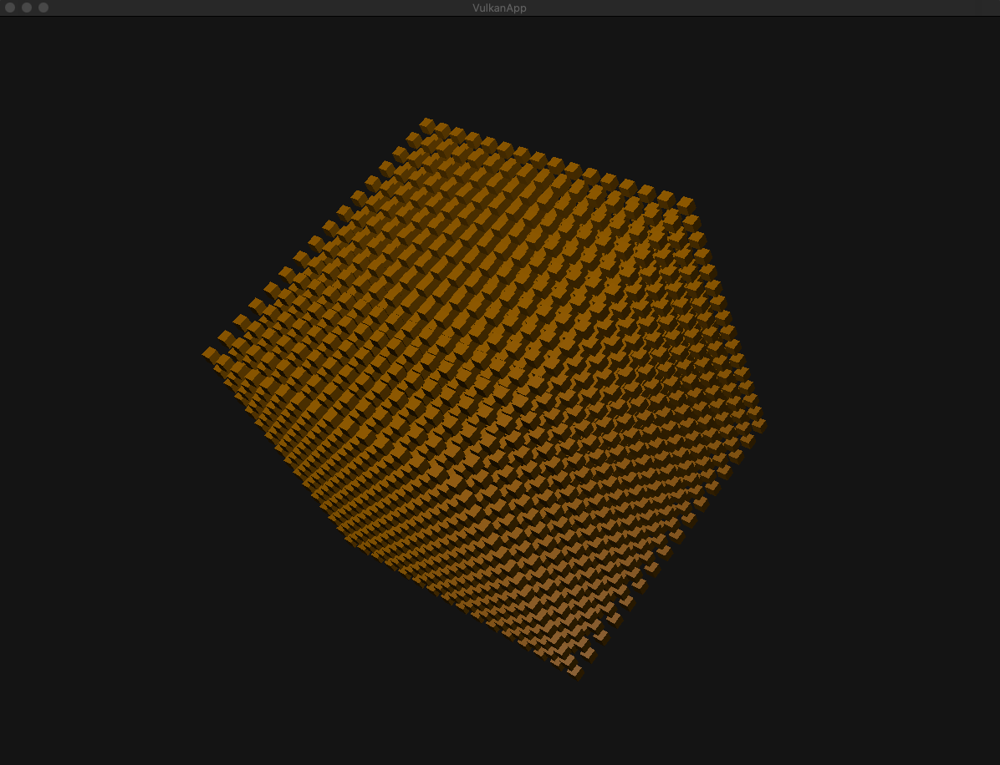

# Subdivider
Code that subdivides various geometric shapes using its vertices (for the sphere) or using its scene graph properties and recursion. Makes use of the Vulkan API

### The making of a sphere!
The algorithm starts with an icosahedron and subdivides its triangles and normalizes the newly generated points such that they line up with a unit sphere. The icosahedron has a convenient property which allows it to be easily defined with points of length 1.

### Subdivided Cube:
The algorithm starts with a cube attached to a node. the node is recursively assigned as a child of itself with transformation such that the position of the cubes remain evenly spaced appart

### Dependencies:
- glfw (window)
- Vulkan (graphics api)
- glm (math library)
- stb_image.h (for importing images: https://github.com/nothings/stb/blob/master/stb_image.h)

*This repo is kept simple as it serves a starting point for other vulkan projects. The features listed can be found in these repo.
